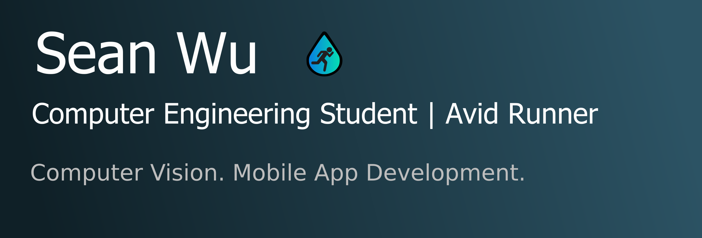

# 

# Hello there! My name is Sean Wu 

I'm a 3rd year computer engineering student at the University of Toronto (EngSci ECE
2T2). Currently, I work on computer vision and running gait analysis on my soon-to-be-released
Android app [FluidStride](https://myfluidstride.com).

I'm passionate about 2D/3D human pose estimation (HPE), signal processing, biomechanics, and software architecture.

I like learning outside of school by working on side projects and going through
MOOC classes. Check out some of my side projects and MOOC LaTeX study notes!

# 💼 Previous Research Internships

Recently, I was a summer research intern at Prof. Genov's [Intelligent Sensory Microsystems Laboratory](https://www.eecg.utoronto.ca/~roman/lab/index.html) at the University of Toronto. I worked on developing new 3D computational imaging applications with Structured Light and Coded Exposure Cameras.

Before that, I researched and developed a mathematical model for MATLAB simulations
of energy efficient air conditioners at the National University of Singapore.

# 🛠 Tech Stack

I mainly work with Python for computer vision and Kotlin for Android app development.

-   💻   
    
    
    
    
-   ➕   
    
    
-   📷   
    
    
-   🌐   
    
    
    
    
-   🔧   
    
    
    
    
-   🎨   
    

# 📈 GitHub Stats

<a href="https://github.com/Seangottarun">
  

<a href="https://github.com/Seangottarun">
  
